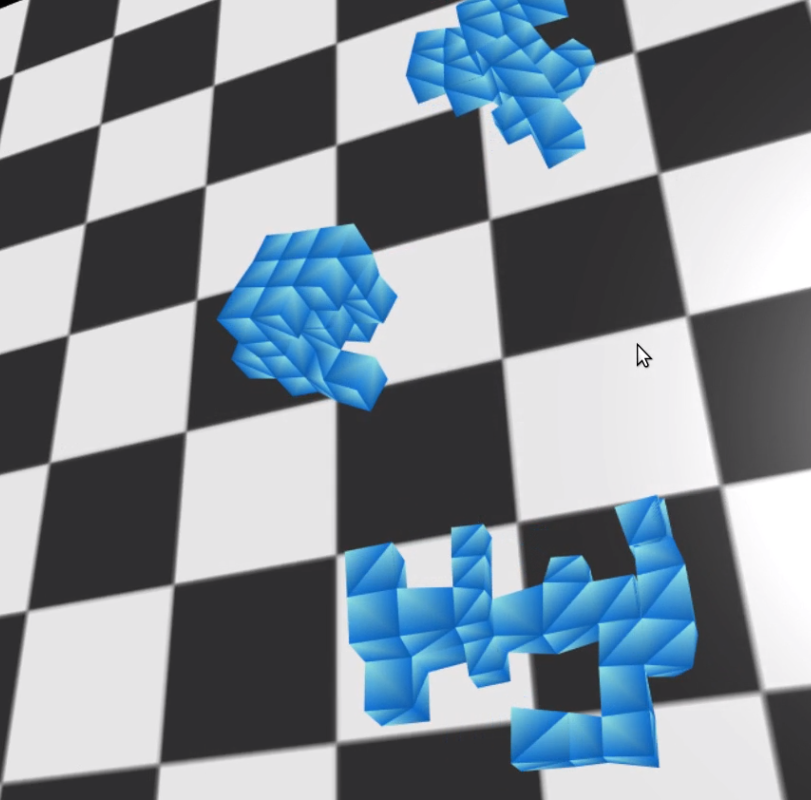
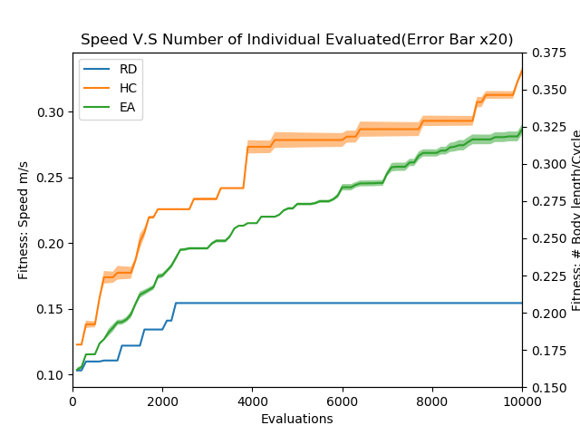
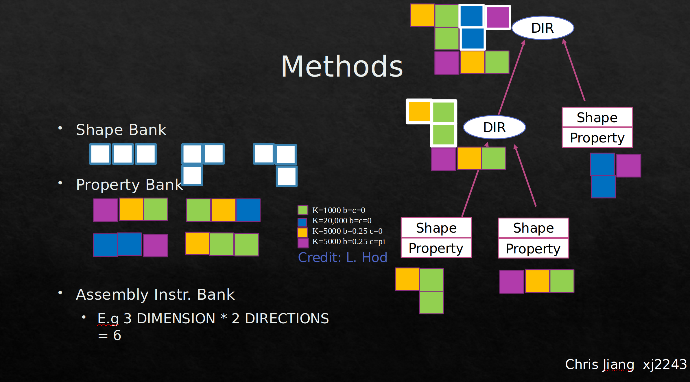

# Genetic Programming for Evolving Morphology

An algorithm to evolve robot with various morphology using genetic programming




## Prerequisite
OS: I use Ubuntu but it is very easy to use VS etc. to have fun with this repo.

Compiler: I use `g++` with `-ofast` and multithread optimization with `opemmp`

For visualization you need `Vpython` to run *main.py*

For plotting you need `numpy` and `matplotlib`

It is recommended to install vpyhon in an [environment](https://anaconda.org/vpython/vpython)

```
conda install -c vpython vpython
```

## Execution
To compile the code you can simply run on terminal:
```
bash  script.sh
```
It will compile the program and automatically start running `a.out`

There are three algorithms that you can play with by changing variable `string TYPE` in `system.hpp`

+ `RD`: random search
+ `HC` beam search AKA hill climber
+ `EA` evolutionary algorithm AKA genetic programming 

After the run, multiple files will be generated because visualization is decoupled.

`status.txt` and `model.txt` are files recoding each frame of the robot moving in the world and the data of the robot itself. 

To see the best evolved robot:

```
python3 main.py
```

`{EA,RD,HC}+rand()+.txt`file is the data file used  for plotting learning curve etc. 

With multiple files generated, you can see the learning curve by typing:

```
python3 plot.py
```

If you have runs with `EA` `RD`  and `HC` The output will look like this:



You can see EA(Genetic Programming) is pretty trash right now but hopefully after more evaluations it can get better. 

## Inspiration

The project is inspired by an evolutionary algorithm for symbolic regression that uses tree representation for function expression to fit datapoints. The implementation can be found here: [GPlearn](https://gplearn.readthedocs.io/en/stable/intro.html)

Building on the idea that the tree representation is a very good way to recursively define the component with a "part-of-whole" relation, the question has now become: **Can we evolve robot and morphology using genetic programming?**

## Tree representation for evolving robot

(man too lazy so he decides to copy and paste from the report) To evolve robot, a tree is used to represent the morphology. Each leaf of the tree is a basic shape with specific material, and each node above a pair of leaves is an assembly command. The command specifies the direction and location where two shapes should be combined. The image below shows an unbalanced tree with 4 material and 3 basic shapes. The tree represents a series of assembly commands.



## Crossover and mutation for tree encoding 

The genetic algorithm depends on two critical operations: crossover and mutation. 

+ Selection Operation
  + The first selection method is similar to beam search algorithm, where parents are selected to mate randomly and the new population is shrunk at each generation so that the population is kept constant. 
+ Crossover Operation
  + The crossover for the tree is similar to symbolic regression, where a random node from parent1 is chosen, and is replaced by a random node from parent2. 
  + For this experiment, only node with the same depth are chosen. Thus, the tree is always balanced.
+  Selection Operation
  + Ranked selection is used for this approach. The child from crossover between parents only replace on of the parents if the fitness is higher

## Spring-mass physics simulator and material selection

Courtesy of Professor [Hod Lipson](https://scholar.google.com/citations?user=F_Go4V4AAAAJ&hl=en&oi=sra) , who detailed the steps for building a basic physics simulator in c++, I am able to simulate the evolved robot and get their fitness. The good thing about the simulator is that it is completely decouple from other things (maybe a little clean up is needed for the code itself)

Each cube that builds into the final robot is an individual "breathing" cube, which is indead consists of 8 masses and 28 springs with time-depended rest length. The idea is derived from Jeff Lecun's paper [Unshackling Evolution: Evolving Soft Robots with MultipleMaterials and a Powerful Generative Encoding](http://jeffclune.com/publications/2013_Softbots_GECCO.pdf) 


